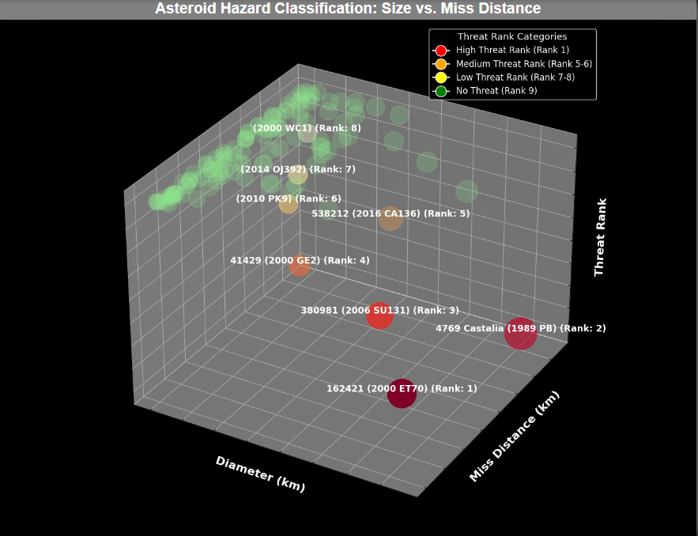

Integrating Python with Power BI for ETL Using NASA's Asteroid Data API

Overview
This guide outlines how to integrate Python with Power BI to fetch, transform, and visualize data from NASA’s asteroid data API. The ETL (Extract, Transform, Load) process showcases Python’s capability to enhance Power BI’s functionality.

Prerequisites
API Key: Obtain your API key from the NASA API portal.
Python Libraries: Ensure you have requests and pandas installed using pip install on your command .
Power BI Desktop: Install Power BI Desktop to run Python scripts.

Step 1: Fetch Data from NASA API
1.1 Obtain API Key
Visit the NASA API portal to sign up and get your API key.

1.2 Fetch Data
Create a Python script to pull data from the API. In Power BI, go to Home -> Get Data -> Other Sources - > Python script and paste your script to load the data.

Step 2: Apply Transformations
2.1 Load  Data into Power BI query editor

2.2 Ensure Libraries
Confirm that all necessary Python libraries are installed in your environment.

2.3 Transform Data
Once the data is loaded as a DataFrame in Power BI, apply transformations such as filtering, normalization, and calculated columns.

Step 3: Visualize Data
3.1 Create Visualizations
Utilize Power BI’s Python Charts within the visualization tools menu to create charts and graphs from your transformed data. For instance, use scatter plots to represent asteroid diameters and miss distances.

Limitations

-Data Row Limitations: Power BI’s Python integration supports up to 150,000 rows. Filter or aggregate data if necessary.
-Query Timeouts: Queries exceeding 30 minutes may time out. Optimize scripts and queries to mitigate this issue.
-You'll need to set your data set to public privacy level and if you want to schedule refresh you'll need either a personal gateway or create a vnet or run your gateway on an aws instance

Conclusion
By integrating Python with Power BI, you can efficiently handle API data requiring authorization, perform complex data transformations, and create sophisticated visualizations. This process demonstrates how Python can extend Power BI’s capabilities, providing a powerful toolkit for data analysis and visualization.
Data Row Limitations: Power BI’s Python integration can handle up to 250,000 rows. If your dataset exceeds this, consider filtering or aggregating data.
Query Timeouts: Queries that take longer than 30 minutes may time out. Optimize your script and queries to avoid this issue.
Conclusion
By integrating Python with Power BI, you can handle API data that requires authorization headers, perform complex data transformations, and create advanced visualizations. This guide demonstrates how Python enhances Power BI’s capabilities, providing a powerful toolset for data analysis and visualization.
